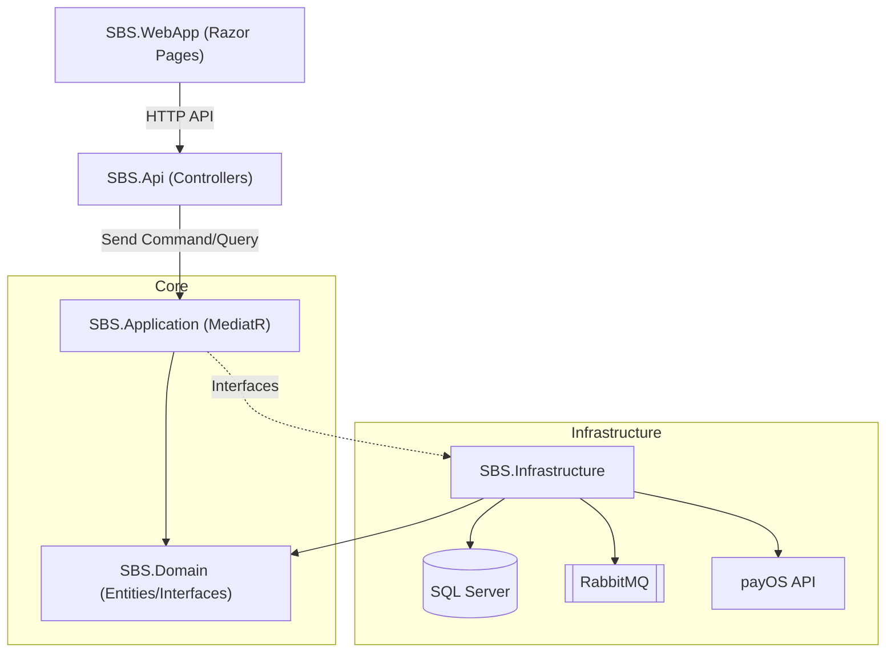
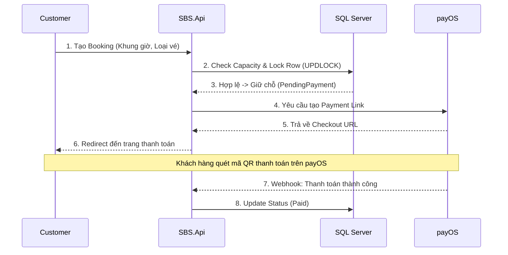
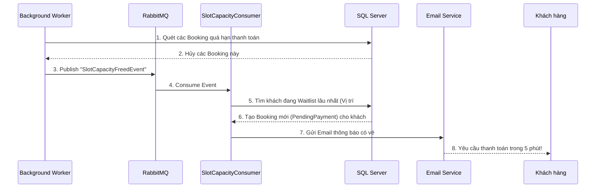

# 🏊 Swimming Booking System (SBS)


**Swimming Booking System (SBS)** là một nền tảng quản lý và đặt vé hồ bơi toàn diện. Hệ thống được xây dựng trên nền tảng .NET 8, áp dụng triệt để các tư tưởng thiết kế phần mềm hiện đại như **Clean Architecture**, **CQRS**, và **Event-Driven Architecture**. Hệ thống được thiết kế để giải quyết bài toán đặt vé trực tuyến có tính cạnh tranh cao (high-concurrency), đảm bảo không xảy ra tình trạng vượt quá sức chứa (Overbooking) và tối ưu hóa trải nghiệm khách hàng với tính năng **Danh sách chờ tự động (Auto-Waitlist)**.

---

## 📑 Mục lục
1. [🌟 Tính năng theo phân hệ](#-tính-năng-theo-phân-hệ-modules)
2. [🏗️ Kiến trúc Hệ thống (Architecture)](#️-kiến-trúc-hệ-thống-architecture)
3. [⚙️ Luồng Nghiệp vụ Lõi (Business Workflows)](#️-luồng-nghiệp-vụ-lõi-business-workflows)
4. [💻 Công nghệ Sử dụng (Tech Stack)](#-công-nghệ-sử-dụng-tech-stack)
5. [📂 Cấu trúc Thư mục (Project Structure)](#-cấu-trúc-thư-mục-project-structure)
6. [🚀 Hướng dẫn Cài đặt & Chạy (Getting Started)](#-hướng-dẫn-cài-đặt--chạy-getting-started)
7. [📜 Quy tắc Lập trình (Coding Guidelines)](#-quy-tắc-lập-trình-coding-guidelines)

---

## 🌟 Tính năng theo phân hệ (Modules)

Hệ thống phục vụ 4 đối tượng người dùng (Actors) chính:

### 1. Khách hàng (Customer)
- **Tìm kiếm & Đặt vé**: Xem lịch trống của các hồ bơi, đặt vé đơn hoặc vé combo.
- **Thanh toán trực tuyến**: Tích hợp cổng thanh toán **payOS** (tạo mã QR chuyển khoản, xác nhận tự động qua Webhook).
- **Hàng chờ (Waitlist)**: Khi ca bơi hết chỗ, khách hàng có thể đăng ký hàng chờ. Hệ thống sẽ tự động xếp chỗ và gửi email thanh toán nếu có người khác hủy vé.
- **Vé điện tử (QR Code)**: Nhận vé điện tử qua email để check-in tại quầy.

### 2. Nhân viên (Staff)
- **Check-in/Check-out**: Quét mã QR của khách hàng để xác nhận sử dụng dịch vụ.
- **Hỗ trợ khách hàng**: Xử lý các vấn đề phát sinh tại quầy.

### 3. Quản lý (Manager)
- **Quản lý Hồ bơi & Ca bơi**: Thiết lập sức chứa (Capacity), khung giờ hoạt động (Slots).
- **Quản lý Giá vé**: Cấu hình giá vé lẻ, vé combo theo thời điểm.
- **Báo cáo thống kê**: Xem doanh thu, công suất lấp đầy của từng hồ bơi.

### 4. Quản trị viên (Admin)
- **Quản lý Tài khoản & Phân quyền**: Quản lý toàn bộ user trong hệ thống.
- **Cấu hình hệ thống**: Thiết lập tham số hệ thống lõi.

---

## 🏗️ Kiến trúc Hệ thống (Architecture)

Dự án áp dụng **Clean Architecture** kết hợp với **CQRS** (Command Query Responsibility Segregation) và phân chia theo chiều dọc (**Vertical Slice Architecture**) trong tầng Application.



### Nguyên tắc thiết kế lõi:
- **Phân tách Read/Write (CQRS)**: Các thao tác ghi (Command) sử dụng DbContext có tracking. Các thao tác đọc (Query) sử dụng ReadDbContext (No-tracking) để tăng hiệu năng.
- **Concurrency Control**: Sử dụng Raw SQL với `WITH (UPDLOCK, ROWLOCK)` tại repository để khóa dòng dữ liệu khi tính toán sức chứa, ngăn chặn tuyệt đối Race Condition.
- **Event-Driven**: Xử lý các tác vụ nặng (như giải phóng hàng chờ, gửi email) thông qua Message Broker (RabbitMQ) để không chặn API request.

---

## ⚙️ Luồng Nghiệp vụ Lõi (Business Workflows)

### 1. Luồng Đặt vé & Thanh toán (Booking Flow)


### 2. Luồng Hàng chờ Tự động (Auto-Waitlist)
Giải quyết bài toán: *Làm sao để công suất hồ bơi luôn được lấp đầy khi có người hủy vé hoặc quá hạn thanh toán?*



---

## 💻 Công nghệ Sử dụng (Tech Stack)

### Backend (Core API)
- **Framework**: .NET 8 (C# 12), ASP.NET Core Web API.
- **Kiến trúc**: Clean Architecture, CQRS.
- **Thư viện lõi**: 
  - `MediatR` (Triển khai CQRS).
  - `FluentValidation` (Validate dữ liệu đầu vào).
  - `MassTransit` (Giao tiếp với RabbitMQ).

### Frontend (Web App)
- **Framework**: ASP.NET Core Razor Pages (Server-side rendering).
- **UI/UX**: 
  - Giao diện tùy chỉnh theo **Ocean Theme** (CSS thuần, không lệ thuộc Tailwind).
  - **SweetAlert2** (Hiển thị popup mượt mà, chuyên nghiệp).
  - AJAX/Fetch API (Gọi API không cần tải lại trang).

### Infrastructure & Database
- **Database**: Microsoft SQL Server (truy xuất qua Entity Framework Core 8).
- **Message Broker**: RabbitMQ (Chạy qua Docker).
- **Third-party Services**: 
  - **payOS**: Xử lý thanh toán qua mã QR chuẩn VietQR.
  - **MailKit/SMTP**: Gửi email thông báo vé tự động.

---

## 📂 Cấu trúc Thư mục (Project Structure)

Dự án tuân thủ nghiêm ngặt theo Clean Architecture, tách biệt rõ ràng ranh giới (boundaries):

```text
SwimmingBookingSystem/
├── SBS.Domain/                 # [Lõi] Chứa Entities, Enums, Value Objects.
│   └── Entities/               # (Booking, PoolSlot, TicketType, WaitlistEntry...)
├── SBS.Application/            # [Nghiệp vụ] CQRS, Interfaces, Validators.
│   ├── Features/               # Tổ chức theo Vertical Slice (Admin, Customer, Staff...)
│   └── Common/                 # Interfaces, Global Exceptions...
├── SBS.Infrastructure/         # [Cơ sở hạ tầng] Kết nối DB, MQ, API ngoài.
│   ├── Data/                   # EF Core DbContext, Migrations.
│   ├── Repositories/           # Triển khai Generic Repository & UnitOfWork.
│   └── BackgroundServices/     # Các HostedService (Worker) chạy ngầm.
├── SBS.Api/                    # [API Endpoint] Nhận Request từ Client.
│   ├── Controllers/            # Mỏng (Thin Controllers), gửi lệnh vào MediatR.
│   └── Middlewares/            # Global Exception Handling, JWT Auth.
└── SBS.WebApp/                 # [Frontend UI] Razor Pages phục vụ người dùng.
    ├── Pages/                  # Chứa UI HTML/CSS/JS.
    └── wwwroot/                # CSS (Ocean Theme), JS, Images.
```

---

## 🚀 Hướng dẫn Cài đặt & Chạy (Getting Started)

### 1. Yêu cầu Hệ thống (Prerequisites)
- [Visual Studio 2022](https://visualstudio.microsoft.com/) hoặc JetBrains Rider.
- [.NET 8 SDK](https://dotnet.microsoft.com/download/dotnet/8.0).
- [Docker Desktop](https://www.docker.com/products/docker-desktop/) (Bắt buộc để chạy RabbitMQ nhanh nhất).

### 2. Cấu hình Môi trường
1. Clone dự án về máy:
   ```bash
   git clone <repo_url>
   cd Final_Project
   ```
2. Mở file `SBS.Api/appsettings.Development.json` và cấu hình các thông số sau:
   - **ConnectionStrings**: Chuỗi kết nối tới SQL Server của bạn.
   - **RabbitMQ**: Nếu dùng Docker nội bộ, thông số mặc định thường là `localhost:5672`, user/pass: `guest/guest`.
   - **payOS**: Điền `ClientId`, `ApiKey`, `ChecksumKey` lấy từ cổng payOS của bạn.
   - **EmailConfiguration**: Điền cấu hình SMTP (ví dụ: Gmail App Password).

### 3. Khởi chạy Dịch vụ Nền (Docker)
Để hệ thống hoạt động đầy đủ tính năng (đặc biệt là Waitlist), RabbitMQ phải đang chạy.
Tại thư mục gốc của dự án, mở Terminal và chạy:
```bash
docker-compose up -d
```
Lệnh này sẽ khởi tạo `RabbitMQ`, `Redis`, và `SQL Server` (nếu bạn sử dụng db trong docker).

### 4. Khởi tạo Database & Chạy ứng dụng
Mở Package Manager Console (PMC) trong Visual Studio, chọn Default Project là `SBS.Infrastructure`:
```powershell
Update-Database -StartupProject SBS.Api
```

Cuối cùng, thiết lập **Multiple Startup Projects** trong Visual Studio để chạy đồng thời 2 dự án:
1. `SBS.Api` (Chạy Backend API, cổng mặc định: `https://localhost:7198`)
2. `SBS.WebApp` (Chạy Frontend Giao diện, cổng mặc định: `https://localhost:7287`)

*(Bấm `F5` để khởi chạy).*


---
*Bản quyền thuộc về Nhóm phát triển Hệ thống SBS (Swimming Booking System)*